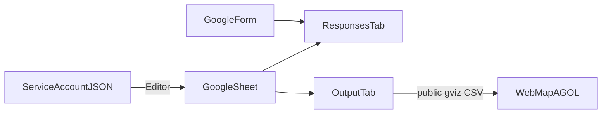

# Configuration: Google Form, Sheet, and service account

Guide to set up the Google side of `sheets-agol-kit`:
form → responses Sheet → read/write with a service account →
clean tab exposed as CSV (gviz) for the ArcGIS Online Web Map.



## 1. Google Cloud — service account

`open_spreadsheet` authenticates with a service-account JSON via gspread.
Nothing is read from environment variables: you pass the file path as an
argument.

1. Open [Google Cloud Console](https://console.cloud.google.com/) and
   create or select a project.
2. Enable **Google Sheets API**
   ([APIs & Services → Library](https://console.cloud.google.com/apis/library)).
3. Also enable **Google Drive API**. gspread uses it when opening a
   spreadsheet by ID.
4. Go to **IAM & Admin → Service Accounts** → **Create service account**.
   Give it a descriptive name (e.g. `sheets-agol-kit`) and create the
   account. No project roles are required for this flow.
5. Open the service account → **Keys** → **Add key** → **Create new key**
   → **JSON**. A `.json` file is downloaded.
6. Store it outside version control, for example:

   ```
   credentials/service_account.json
   ```

   The `credentials/` folder is in `.gitignore`. Do not commit the JSON
   or paste it into issues or chats.
7. Note the account email (`…@….iam.gserviceaccount.com`). You need it
   to share the Sheet in step 3.

## 2. Google Form

1. Create a [Google Form](https://forms.google.com/) with questions for
   your domain (place, municipality/area, report type, etc.).
2. On the **Responses** tab, choose **Link to Sheets** (create a new
   spreadsheet or use an existing one). Google creates a responses tab;
   the typical Spanish default name is `Respuestas de formulario 1`.
3. Keep headers stable. The library detects them with `map_columns` by
   keywords (case- and accent-insensitive). If you change a question's
   text, update keywords or `overrides`.
4. For `gps` precision (no Nominatim), allow in the place field:
   - pasted coordinates (`18.486090, -66.783960`)
   - long Google Maps URL
   - short Share link (`maps.app.goo.gl` / `goo.gl/maps`)

   Details are in the
   [README](../README.md#location-capture-and-precision-levels).

## 3. Google Sheet

1. Open the Sheet linked to the Form. The **ID** is in the URL:

   ```
   https://docs.google.com/spreadsheets/d/<SHEET_ID>/edit
   ```

2. Share the document with the service-account email as **Editor**. This
   is required to read the responses tab and write the clean tab
   (`sync` / `write_rows`).
3. Responses tab: the app only reads it. Do not delete it or rename it
   without updating the `responses_tab` argument.
4. Output tab (e.g. `mapa`): if missing, `write_rows` creates it and
   rewrites it fully on every sync.
5. For the AGOL Web Map, the gviz URL must be readable **without
   authentication**. Publish the Sheet (or ensure anyone with the link
   can view it) so `gviz_csv_url(sheet_id, tab)` works as a remote CSV
   layer.

   URL format:

   ```
   https://docs.google.com/spreadsheets/d/<SHEET_ID>/gviz/tq?tqx=out:csv&sheet=<tab>
   ```

## 4. Quick checklist

- [ ] Google Sheets API and Google Drive API enabled in the project
- [ ] Service-account JSON under `credentials/` (not versioned)
- [ ] Sheet shared with the service-account email as **Editor**
- [ ] Form linked to that Sheet (responses tab present)
- [ ] `SHEET_ID` and tab names (`responses_tab`, `output_tab`) ready for
      the [minimal example](../examples/sync_minimal.py)
      (also in the [README](../README.md#sync-a-sheet))
- [ ] Sheet publicly visible (or link-shared) if you will use the CSV
      layer on AGOL

When the checklist is done, run the
[minimal example](../examples/README.md) or call
`open_spreadsheet("SHEET_ID", "credentials/service_account.json")` and
continue with `sync` / `create_webmap` as in the README.

## 5. Common issues

| Symptom | What to check |
|---|---|
| Error opening the Sheet / API not enabled | In Cloud Console, confirm **Google Sheets API** and **Google Drive API** are enabled in the same project as the service account. |
| `403` / permission denied | Share the Sheet with the `…@….iam.gserviceaccount.com` email as **Editor** (Viewer is not enough if you write the clean tab). |
| `WorksheetNotFound` on responses | The Form may have renamed the tab; use the exact name in `responses_tab` (Spanish default is often `Respuestas de formulario 1`). |
| Empty gviz or AGOL does not load the CSV | The Sheet (or “anyone with the link”) must allow read access **without** authentication. Open the gviz URL in a private browser window. |
| Columns not detected | Form headers changed; adjust `keywords` or use `overrides` in `map_columns`. |
