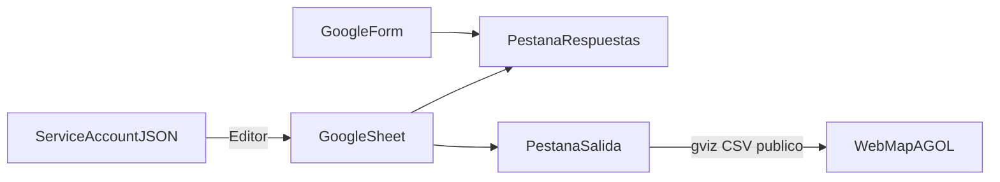

# Configuración: Google Form, Sheet y service account

Guía para dejar listo el entorno Google que usa `sheets-agol-kit`:
formulario → Sheet de respuestas → lectura/escritura con service account →
pestaña limpia expuesta como CSV (gviz) para el Web Map en ArcGIS Online.



## 1. Google Cloud — service account

`open_spreadsheet` autentica con un JSON de service account vía gspread.
Nada se lee de variables de entorno: pasas la ruta del archivo como argumento.

1. Entra en [Google Cloud Console](https://console.cloud.google.com/) y
   crea o selecciona un proyecto.
2. Habilita **Google Sheets API**
   ([APIs y servicios → Biblioteca](https://console.cloud.google.com/apis/library)).
3. Habilita también **Google Drive API**. gspread la usa al abrir el
   spreadsheet por ID.
4. Ve a **IAM y administración → Cuentas de servicio** → **Crear cuenta de
   servicio**. Dale un nombre descriptivo (ej. `sheets-agol-kit`) y crea la
   cuenta. No hace falta asignar roles de proyecto para este flujo.
5. Abre la service account → **Claves** → **Agregar clave** → **Crear clave
   nueva** → **JSON**. Se descarga un archivo `.json`.
6. Guárdalo fuera del control de versiones, por ejemplo:

   ```
   credentials/service_account.json
   ```

   La carpeta `credentials/` está en `.gitignore`. No subas el JSON al
   repositorio ni lo pegues en issues o chats.
7. Anota el email de la cuenta (`…@….iam.gserviceaccount.com`). Lo
   necesitas para compartir el Sheet en el paso 3.

## 2. Google Form

1. Crea un [Google Form](https://forms.google.com/) con las preguntas de tu
   dominio (lugar, municipio/área, tipo de reporte, etc.).
2. En la pestaña **Respuestas**, elige **Vincular a Hojas de cálculo**
   (crear una hoja nueva o usar una existente). Google creará una pestaña
   de respuestas; el nombre típico en español es
   `Respuestas de formulario 1`.
3. Mantén encabezados estables. La librería los detecta con
   `map_columns` por palabras clave (sin acentos ni mayúsculas). Si
   cambias el texto de una pregunta, actualiza keywords u `overrides`.
4. Para ubicación con precisión `gps` (sin Nominatim), conviene permitir
   en el campo de lugar:
   - coordenadas pegadas (`18.486090, -66.783960`)
   - URL larga de Google Maps
   - enlace corto de Compartir (`maps.app.goo.gl` / `goo.gl/maps`)

   El detalle está en el [README](../README.md#captura-de-ubicación-y-niveles-de-precisión).

## 3. Google Sheet

1. Abre el Sheet vinculado al Form. El **ID** está en la URL:

   ```
   https://docs.google.com/spreadsheets/d/<SHEET_ID>/edit
   ```

2. Comparte el documento con el email de la service account con permiso
   de **Editor**. Hace falta para leer la pestaña de respuestas y
   escribir la pestaña limpia (`sync` / `write_rows`).
3. Pestaña de respuestas: la app solo la lee. No la borres ni cambies su
   nombre sin actualizar el argumento `responses_tab`.
4. Pestaña de salida (ej. `mapa`): si no existe, `write_rows` la crea y
   la reescribe completa en cada sincronización.
5. Para el Web Map en AGOL, la URL gviz debe ser legible **sin
   autenticación**. Publica el Sheet (o al menos asegúrate de que
   cualquiera con el enlace pueda verlo) para que
   `gviz_csv_url(sheet_id, tab)` funcione como capa CSV remota.

   Formato de la URL:

   ```
   https://docs.google.com/spreadsheets/d/<SHEET_ID>/gviz/tq?tqx=out:csv&sheet=<tab>
   ```

## 4. Verificación rápida

- [ ] Google Sheets API y Google Drive API habilitadas en el proyecto
- [ ] JSON de la service account en `credentials/` (no versionado)
- [ ] Sheet compartido con el email de la service account como **Editor**
- [ ] Form vinculado a ese Sheet (pestaña de respuestas presente)
- [ ] `SHEET_ID` y nombres de pestañas (`responses_tab`, `output_tab`)
      listos para el [ejemplo mínimo](../examples/sync_minimal.py)
      (también en el [README](../README.md#sincronizar-un-sheet))
- [ ] Sheet visible públicamente (o con enlace) si vas a usar la capa CSV
      en AGOL

Cuando todo lo anterior esté listo, ejecuta el
[ejemplo mínimo](../examples/README.md) o llama a
`open_spreadsheet("SHEET_ID", "credentials/service_account.json")` y
sigue con `sync` / `create_webmap` según el README.

## 5. Problemas frecuentes

| Síntoma | Qué revisar |
|---|---|
| Error al abrir el Sheet / API no habilitada | En Cloud Console, confirma **Google Sheets API** y **Google Drive API** en el mismo proyecto de la service account. |
| `403` / permiso denegado | Comparte el Sheet con el email `…@….iam.gserviceaccount.com` como **Editor** (no basta Viewer si vas a escribir la pestaña limpia). |
| `WorksheetNotFound` en respuestas | El Form pudo renombrar la pestaña; usa el nombre exacto en `responses_tab` (por defecto suele ser `Respuestas de formulario 1`). |
| gviz vacío o AGOL no carga el CSV | El Sheet (o el acceso “cualquiera con el enlace”) debe permitir lectura **sin** autenticación. Prueba la URL gviz en el navegador en una ventana privada. |
| Columnas no detectadas | Los encabezados del Form cambiaron; ajusta `keywords` o usa `overrides` en `map_columns`. |
